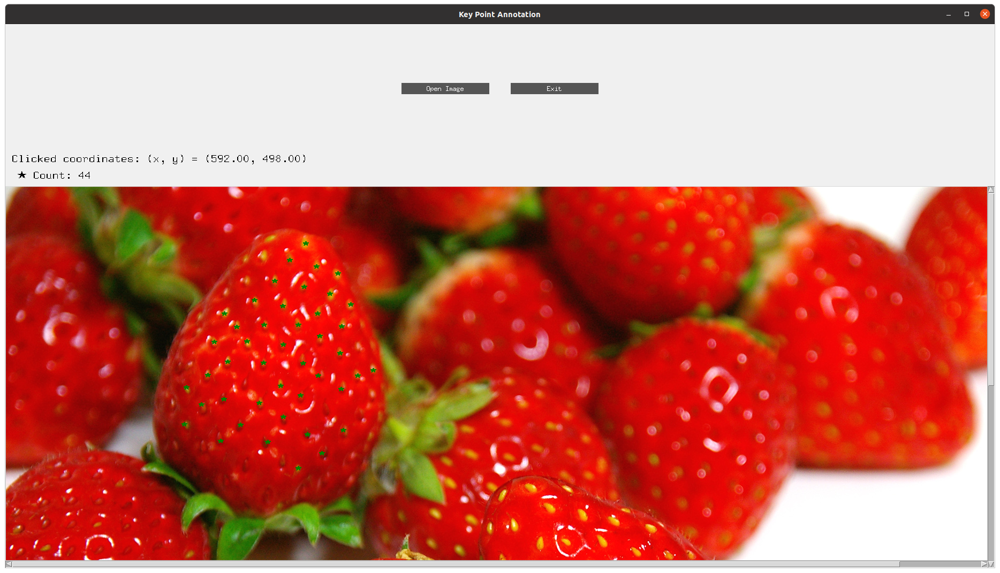
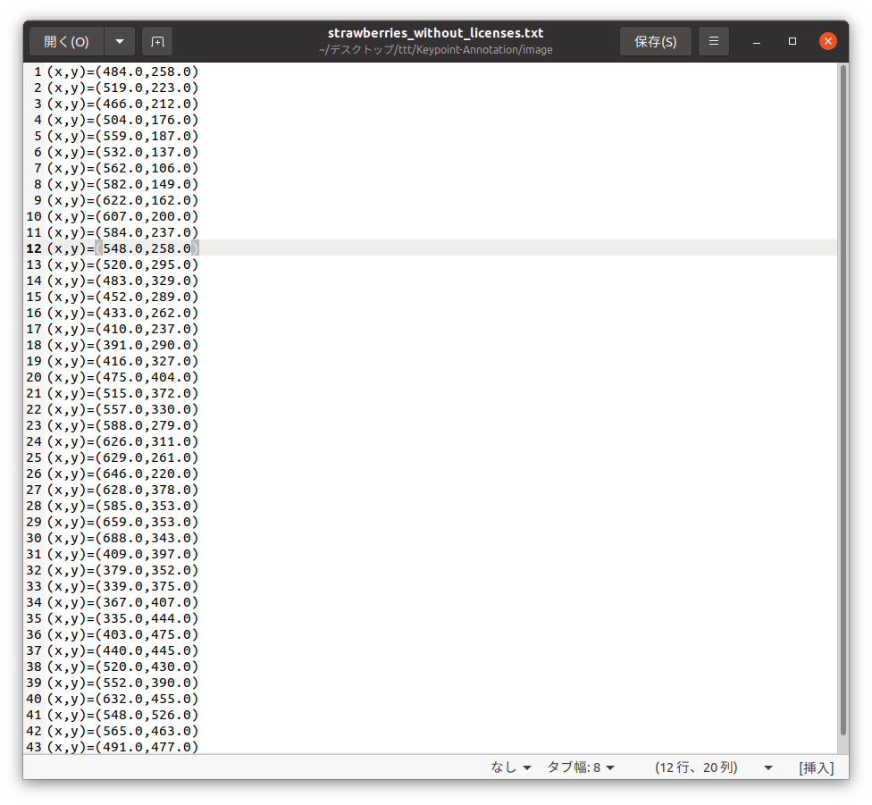

# Keypoint-Annotation
This is a tool that stores the coordinates of images in a text file. Since there was no keypoint annotation tool available, I created it myself. When you click on the image, a mark is displayed, and the coordinates are saved in a text file. Please use it when measuring the coordinates of many small objects.





# Requirement

* Python 3.9.16


Environments under [Anaconda for Linux](https://www.anaconda.com/distribution/) is tested.
I tried the code for testing on Ubuntu 18. 

```
conda create -n ano python=3.9.16
conda activate ano
pip3 install -r requirements.txt
pyinstaller --onefile --hidden-import=PIL._tkinter_finder annotation.py
./dist/annotation
```
 
# Usage
 
Make exe file.
 
```bash
pyinstaller --onefile --hidden-import=PIL._tkinter_finder annotation.py
```

Test exe file.
 
```bash
./dist/annotation
```

# Note
 
I don't test environments under Win and Mac.